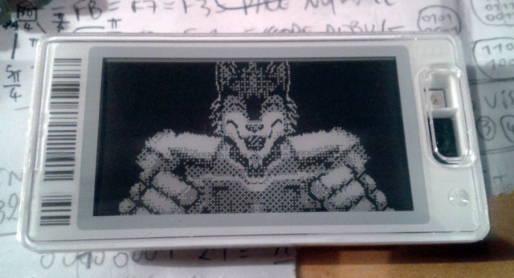

# PrecIR

Collection of software and hardware tools, their source code and design files for communicating with **infrared based** Electronic Shelf Labels.

See http://furrtek.free.fr/index.php?a=esl for more details.

Thanks to [@david4599](https://github.com/david4599) for infos about color tags.

## Hardware

* ir_tx_serial: Simple DIY serial port transmitter, requires an USB-serial adapter.
* esl_blaster: Compact USB transmitter/remote. Build it yourself or buy one from [Tindie](https://www.tindie.com/products/furrtek/esl-blaster/).

## Tools

* img2dm.py: Sends an image to an e-paper ESL. Run without parameters for help.
* rawcmd.py: Send arbitrary data to ESL.
* setsegs.py: Set display of segment ESL.
* flashtest.py: Test tool to program the remote control frames of the ESL Blaster (more work needed).
* vb6: Windows GUI client and VB6 source (sorry).
* PriceHax: Android app, doubles as a barcode scanner for quick ESL updates.

## FAQ

***What can this be used for ?***

To have fun experimenting with mass produced devices ! Compatible ESLs can be found on eBay, or directly from stores shelves ;)

The e-paper ones can make cool badges:

***Which brands of ESLs are compatible ?***

You'll have to guess from the picture and the page on my website. Hint: there's only one.

***Can my phone/tablet/handheld/IrDA-capable device work as a transmitter ?***

No. The carrier is in the MHz range and the symbol timing must be very precise. IrDA controller limitations and OS latency makes it impossible.

***Can I change the display of all ESLs in a store at once ?***

No. For two reasons:
* Unlike radio waves, optical communication must be line-of-sight. Even if the walls are painted white, reflections from an unique transmitter has no chance of reaching all of the hundreds or thousands of ESLs in a store.
* Each ESL has an unique address which must be specified in update commands. There's no known way to broadcast display updates.

***Is possession and use of such devices legal ?***

There's no cracking, exploit, patent or copyright infrigement going on so IMO it's safe to assume this is perfectly legal. Just don't try changing price displays so you can get discounts, the price in the store's database obviously remains unchanged so you'll end up having to pay the correct price anyways.
