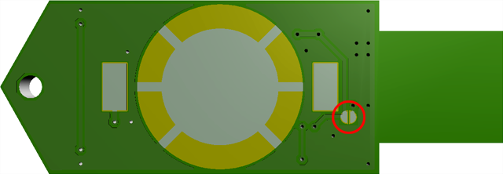
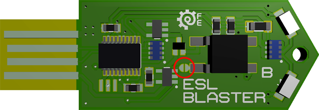

# ESL Blaster

USB IR transmitter firmware and hardware design files.

Sometimes available for purchase on [Tindie](https://www.tindie.com/products/furrtek/esl-blaster).

## Installation

For Linux and Windows 7 you might have to download the [STM32 VCP driver](https://www.st.com/en/development-tools/stsw-stm32102.html). Windows 8 and up should install the correct driver automatically.

The device will simply appear as a Virtual COM Port. As there's no real COM Port interface, speed and data format doesn't matter.

## Firmware update

Short the two solder pads on the back:

Plug the device in and use `dfu-util-0.9-win64` with `FW\Release\program.bat` to update the firmware.

Don't forget to disconnect the pads once done.

## Using a non-rechargeable (CR2032) battery

Disconnect the two solder pads next to the push-button to disable the charging circuit:

