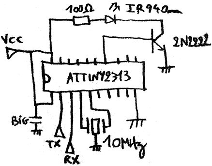

# IR transmitter (serial port version)

For ATTiny2313 @ 10MHz. No resistor on transistor base to get max range (LED is on during very short pulses). If you're not feeling it, you can add a 10~100 ohm resistor.

See comments in the only source file for the serial protocol info.

